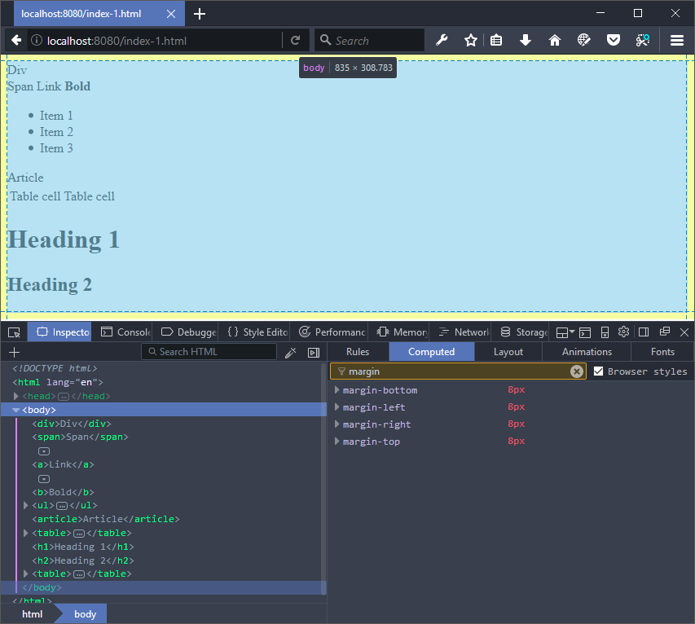
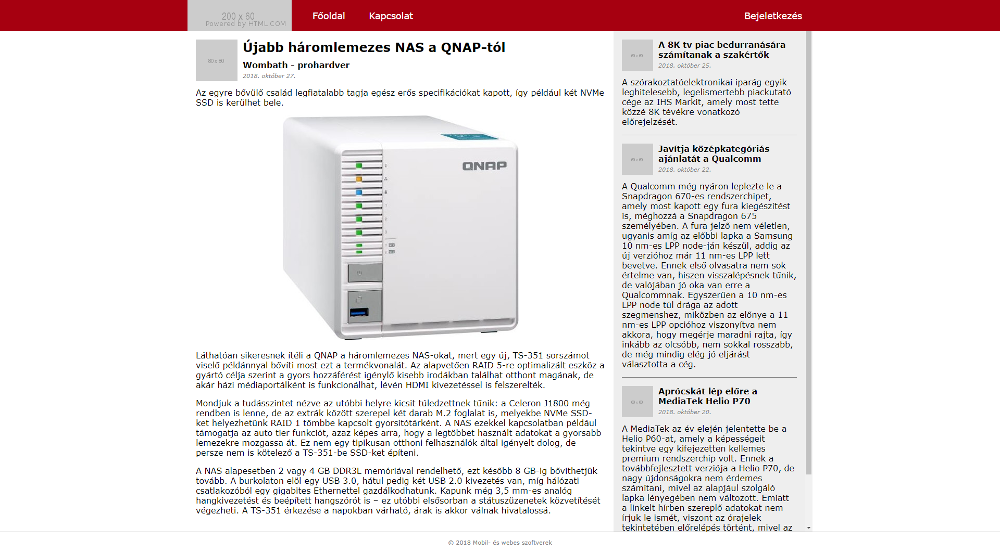
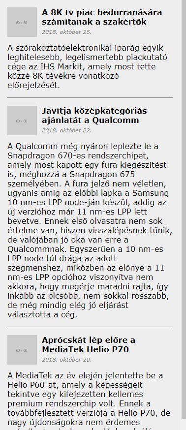

# Labor 09 - CSS

## Bevezetés

A laborok során a hallgatók laborvezetői segítséggel, majd önállóan végeznek feladatokat a webes technológiák gyakorlati megismerése érdekében.

A feladatok megoldása során ne felejtsd el követni a feladat beadás folyamatát TODO LINK.

### Git repository létrehozása és letöltése

1. Moodle-ben keresd meg a laborhoz tartozó meghívó URL-jét és annak segítségével hozd létre a saját repository-dat.
2. Várd meg, míg elkészül a repository, majd checkout-old ki.
    > Egyetemi laborokban, ha a checkout során nem kér a rendszer felhasználónevet és jelszót, és nem sikerül a checkout, akkor valószínűleg a gépen korábban megjegyzett felhasználónévvel próbálkozott a rendszer. Először töröld ki a mentett belépési adatokat (lásd itt), és próbáld újra.
3. Hozz létre egy új ágat `megoldas` néven, és ezen az ágon dolgozz.
4. A neptun.txt fájlba írd bele a Neptun kódodat. A fájlban semmi más ne szerepeljen, csak egyetlen sorban a Neptun kód 6 karaktere.

## Feladat 1 - Stíluslapok, inline stílusok

Webes HTML tartalmak stílusozására CSS-t használunk. A CSS alapjai:

* szabály (mintaillesztés) alapú, deklaratív programozási nyelv,
* DOM elemekhez megjelenést rendel.

A böngészőben megjelenített HTML tartalmak alapértelmezés szerint formázatlanok, viszont bizonyos szabályokat a böngésző alapértelmezetten illeszt az egyes elemekre, az elem típusa szerint.

Vizsgáljuk meg, milyen szabályokat illeszt a böngésző a HTML, a BODY, a DIV, a SPAN, a H1, H2, az A és a B elemekre!

Nyissuk meg a Visual Studio Code-ban a leklónozott repositorynkat, és dolgozzunk a `feladat1-3` mappában lévő `index.html`-ben.

Szükségünk lesz egy webszerverre, ami ki tudja szolgálni nekünk a fájlokat. Futtassuk az alábbi parancsot a Terminal (**Ctrl+ö** vagy **View > Integrated Terminal**) ablakból: `http-server`

!!! warning "Figyelem!"
    **Ügyeljen rá, hogy a parancsot a megfelelő munkakönyvtárban adja ki, ahol a szerkesztett fájl is található!**
    Ez elindít nekünk egy egyszerű HTTP szervert a gép 8080-as portján (http://localhost:8080/), ahonnan egyszerűen ki tudjuk szolgálni a mappában levő fájlokat, ill. index.html fájl hiányában egy fájllistázó főoldalt kapunk.

Navigáljunk a http://localhost:8080/ URL-re a böngészőben! Nyissuk meg az itt látható **index.html** fájlt! Az alábbit kell látnunk:


Vegyük észre, hogy az oldalhoz nem vettünk fel saját stíluslapot, valamilyen formázás mégis érvényesült. Egyes elemek félkövérek, kisebbek-nagyobbak, elrendezésük sorfolytonos vagy tördelt.

Vizsgáljuk meg, milyen szabályok érvényesülnek az egyes elemekre!

Nyissuk meg a böngésző beépített fejlesztői eszközeit (**F12**)! Lehetőségünk van az elemeket kijelölni (**Jobb klikk** > **Inspect Element**), megnézni elhelyezkedésüket a felületen és a DOM szöveges reprezentációjában egyaránt.


**Fontos!** A böngészők és/vagy bizonyos szerverek túl agresszívan gyorsítótárazhatnak bizonyos fájlokat, pl. a HTML és CSS fájljainkat, így a változásokat nem biztos, hogy látni fogjuk egyszerű újratöltés után. Ha ez előfordul, a cache letiltásához a Developer Tools eszköztáron ki kell kapcsolnunk a cache-t.

Jellemzően a menüsor bal oldalán találhatók a kijelöléshez szükséges műveletek ikonjai, jobb oldalon a részletes nézet.

A kiválasztott elemhez a jobb oldali **Computed** fülön a ténylegesen érvényre lépett szabályokat láthatjuk. Mivel nincs explicit CSS fájlunk linkelve és CSS szabályokat sem írtunk a HTML-ben, ezért kizárólag a böngésző beépített **user agent stylesheet**-je érvényesül. Itt láthatjuk a **CSS Box model**t is, ami az elem **tartalma**, a hozzá tartozó **padding**, **border** és **margin** értékek egymásra halmozását jelenti a *2 dimenziós téglalap* oldalaihoz mérten.

A CSS feloldásában a `cascading`, azaz "egymásba ágyazható" rész szerint több stíluslap létezik a származás szempontjából; mi most a *böngészőbe beépített*, ún. `user agent stylesheet`-et látjuk.

A user agent stylesheet alapértelmezetten nem biztos, hogy látható a felületen, a Computed fülön van lehetőségünk ezek megtekintését bekapcsolni ("Browser styles"/"Show all" stb. lehetőségek):


A fenti szűrőt használva van lehetőségünk az alkalmazott CSS szabályok között keresni is.

A **h1**, **h2** és **b** elemek alapértelmezetten félkövérek, ezt a `font-weight: 700;` tulajdonság írja le nekünk.

A **html**, **body**, **div**, **h1**, **h2** elemek `display` tulajdonsága `block`, a **span**, **a** és **b** elemek pedig `inline` típusúak. A `display: block;` tulajdonságú elemek egy blokkot (sort) foglalnak el az őket befoglaló elemben, az inline típusúak sorfolytonosak (egymás mellett is elhelyezkedhetnek).

Láthatjuk, hogy a `body` elemen található `8px` margó (`margin`) mind a 4 irányban:



!!! example "BEADANDÓ (0.5 pont)"
    Egy-egy képernyőképpel alátámasztva demonstrálja az alábbi kérdéseket:
    * Mekkora a **margin**, **padding** és **border** értéke az `<ul>` elemnek? `f1.1.png`
    * Hány pixel a (függőleges) távolság a `<h1>` és `<h2>` elemek tartalma között (ügyelve az átfedő margókra)? `f1.2.png`

??? note "Emlékeztető a CSS szabályok definiálásához"
    Saját CSS szabályokat többféle módon tudunk az oldalunkhoz rendelni:

    * CSS fájlokra történő hivatkozással,
    * CSS szabályok felvételével a HTML tartalmán belüli `<style>` tagben,
    * inline, a HTML elemek `style` attribútumának beállításával.

    Ütköző CSS szabályok közül az érvényesül, amelynek nagyobb a specificitása (megegyező specificitás esetében az utoljára definiált).

    Emlékeztetőként a szabályok specificitási sorrendje:
    - inline stílus (`<div style="..."> `),
    - ID-k száma (`#azonosito`),
    - osztályok, attribútumok és pszeudo-osztályok száma (`.osztaly`, `[attributum]`, `[attributum="ertek"]`, `:hover`),
    - pszeudo-elemek (`:before`, `:after`).

    A sorrendhez hozzátartozik az `!important` kulcsszó, ami önmagában a fentiektől specifikusabb, viszont az `!important` szabályokra a fenti specificitási sorrend szintén érvényesül.

    A szabályok definiálása:

    
    

Módosítsuk az oldal megjelenését futási időben!

* Rejtsük el a böngésző beépített stílusait, és láthatjuk, hogy kizárólag az üres inline stílus illeszkedik így az elemre. Itt hozzá tudunk adni új inline stílust az elemhez.
* Ha új szabályt akarunk felvenni, akkor a kapcsos zárójelek közé kattintva tehetjük ezt meg, ezután az automatikus kiegészítés funkcióval láthatjuk az összes, a böngésző által ismert CSS tulajdonságot (Firefox Developerben ezt az üres kurzoron a **fel-le nyilak**kal tehetjük meg, Edge-ben és Chrome-ban a **Ctrl+szóköz**zel).
* Vegyük fel a `<h1>` elemhez az alábbi CSS tulajdonságot:

    ```css
    color: red;
    ```

* Közben vegyük észre a DOM reprezentációban, hogy bár a jobb oldali panelen szerkesztünk, pontosan ugyanaz történik, mintha a HTML elem `style` attribútumát adtuk volna meg.
* Ha beállítjuk a `font-weight: bold;` tulajdonságot a `<body>`-n, akkor láthatjuk, hogy az összes gyermekére is érvényesül a szabály. Bizonyos szabályok öröklődnek (a `font-weight` ilyen), mások (például a `padding` és `margin`) viszont nem.

Lehetőség van esetenként több szabály aggregált megadására is ún. shorthandek használatával. Gyakori például a 4-irányú értékadás, ami a **top-right-bottom-left** iránysorrend szerint ad meg több értéket.

* A `padding: 50px 30px 10px 5px;` szabály mind a négy értéket beállítja a fenti sorrend szerint.
* A `padding: 10% 1mm;` szabály a fenti-lenti értékeket 10%-ra, a jobb-balt 1 mm-re (a padding-top).
    * A százalékos értékek a szülő elem *szélességéhez* viszonyítottak (ha `padding-top`-ot vagy `margin-bottom`-ot adunk meg, akkor is szélességhez).
* A `padding: 0;` mind a 4 oldalon 0-ra állítja a paddingot (nem szükséges mértékegység 0 esetén).

!!! warning "Inline stílusok"
    Inline stílusokat csak kivételes esetekben használjunk, jellemzően programozottan (JavaScriptből) elfogadott lehet egy elem megjelenését ilyen módon állítani, de a nyers HTML-ben nem!

## Feladat 2. - CSS

Az oldalhoz alapvetően kétféle módon van lehetőségünk stíluslapot rendelni: külső CSS fájlból vagy az oldalban definiált `<style>` tagben.

Az `index.html` forráskódját egészítsük ki, a `<head>` elembe helyezzük el az alábbi kódot:

```html
<style>
    ul {
        list-style: none;
        padding: 0;
    }

    ul > li {
        float: left;
        padding: 10px;
        min-width: 200px;
        border: 1px solid grey;
    }
</style>
```

Ha frissítjük az oldalt (nem szükséges újraindítani a szervert, csak menteni a fájlt), akkor az elrendezés módosul: a listánkban a listaelemek egymás mellé kerülnek, és a listaelemet jelző pötty eltűnik.

!!! warning "float: left"
    A `float: left;` tulajdonság állításával nem ugyanazt érjük el, mintha a listaelemet `display: inline-block;`-ra állítanánk, mert az `inline-block` megtartja az egymást követő elemek közötti whitespace-eket, a `float: left;` viszont nem.

A float segítségével komplexebb elrendezéseket is el tudunk érni, viszont a float-olást meg kell tudnunk szüntetni. Ehhez a `clear: both;` értéket állíthatjuk be egy elemen. A float-olás azon kevés CSS tulajdonság egyike, ami az elemet sorban követő további testvérekre is közvetlenül hat.

Az alábbi szabályt használhatjuk a float-olás megszüntetéséhez, ekkor az `<article>` elemre a `clearfix` osztályt alkalmazva az már új sorba is kerül.

```css
.clearfix {
    clear: both;
}
```

```html
<article class="clearfix">
  <!-- ... -->
</article>
```

A CSS szabályainknak az esetek nagy többségében nem tesz jót, ha túl általánosak. A fenti szabályok minden listaelemre általánosan illeszkedni fognak, ami ebben a konkrét esetben nem jó döntés, ugyanis valahol az oldal törzsében lehet, hogy szeretnénk használni a "klasszikus" listás megjelenítést is. Ezért a szabályunkat át kell gondolnunk, specifikusabb szabályt érdemes írni:

```css
ul.menu {
    list-style: none;
    padding: 0;
}

ul.menu > li {
    float: left;
    padding: 10px;
    min-width: 200px;
    border: 1px solid grey;
}
```

A fenti osztállyal megkülönböztettük a `menu` osztállyal ellátott `ul` elemeket azoktól, amiken nincs rajta az osztály.

A pszeudoosztályok használatával az elemek különböző állapotainak különböző stílust tudunk adni. Ha a listaelemek kijelölése a felhasználó számára speciális állapot, ezt érdemes jeleznünk a felületen. Használjuk az alábbi szabályt:

```css
ul.menu > li:focus {
    font-weight: bold;
    color: #44AA44;
}
```

Önmagában a `focus` pszeudoosztály használata nem elegendő, ugyanis a li elem nem fókuszálható. A `<li>` elemen elhelyezett tabindex attribútum jelzi a böngészőnek, hogy az elem képes fókuszt kapni:

```html
<ul class="menu">
    <li tabindex="1">Item 1</li>
    <li tabindex="2">Item 2</li>
    <li tabindex="3">Item 3</li>
</ul>
```

Ezután lehetséges az egér kattintással vagy a Tab billentyű használatával kijelölni az elemet.

A HTML-be ágyazott CSS-sel a probléma, hogy ugyanaz a stílus nem újrahasznosítható a különböző oldalaink között. Ezért érdemes kiszervezni a CSS tartalmainkat a saját dedikált CSS fájljainkba. A CSS tartalmát mozgassuk át a HTML `<head>` részéből egy új fájlba az `index.html` mellett, legyen a neve `index.css`.

A fájlt a HTML-ből az alábbi módon tudjuk linkelni: tegyük az oldal `<head>` részébe (a korábbi oldalon belüli stílus-definíciók helyére) az alábbi hivatkozást:

```html
<link rel="stylesheet" type="text/css" href="index.css">
```

!!! example "BEADANDÓ (0.5 pont)"
    Képernyőképpel demonstrálja, hogy:

    * Az index.html letöltődését követően az index.css fájl is letöltődik. (`f2.1.png`)
    * Az `<ul>` lista elemei egymás mellett helyezkednek el. (`f2.2.png`) Ehhez a HTML-t módosítani szükséges és commitolni.
    * Az egyik listaelem kijelölt állapotában a betűszín zöld lesz, a karakterek félkövérek. (`f2.3.png`)

## Feladat 3 - Reszponzív elrendezés

A weboldalakat különböző képernyőméretű és felbontású eszközökről szoktuk látogatni. A túl részletes táblázatok, hosszú, meg nem törő sorok nem felhasználóbarátak kisebb méretű kijelzőkön, még ha az eszköz felbontása kellően nagy is. A mobil eszközök ezért szorzókat alkalmaznak a valós és a hasznos felbontás közötti megkülönböztetésképpen.

A reszponzív elrendezés során a legfontosabb koncepciók közé tartozik a szélesség függvényében történő átméretezése az oldalnak. Ezeket az alábbi szintaxis alapján, ún. media query-vel tudjuk implementálni:

```css
.medium-only {
    display: none;
}

@media (min-width: 768px) and (max-width: 991px) {
    .medium-only {
        display: block;
    }
}
```

A fenti szabály 768 és 991 pixel közötti szélességű viewport-on jelenik meg, tehát nem a képernyő mérete, hanem a rendelkezésre álló hely függvényében változik (pl. ablak átméretezésekor is). A `medium-only` osztállyal ellátott elemek csak ilyen képernyőméreten jelennek meg, ugyanis a media query szabály specifikusabb, mint az azon kívül definiált.

Próbáljuk ki, mi történik, hogyha a két szabály sorrendjét felcseréljük!

!!! example "BEADANDÓ (0.5 pont)"
    Képernyőképekkel demonstrálja, hogy a fenti szabályt tetszőleges elemekre alkalmazva azok az ablak méretének függvényében láthatók vagy el vannak rejtve! (`f3.1.png, f3.2.png`)

## Feladat 4 (önálló) - CSS egy komplexebb feladatban (3.5 pont)

Mostantól a `Feladat4` mappában lévő állományokkal dolgozzon.

Készítse el a kiinduló HTML oldal designját, mely megközelíti a lenti képeken látható elrendezést és megjelenést!
Figyeljen rá, hogy a megvalósítás során nem alkalmazhat inline stílusokat, és kerülje a HTML fájl módosítását.




### Fejléc (1 pont)

A fejléc megjelenését a `navbar.css` fájlba készítse el, amit először létre kell hozni. (A HTML oldal már hivatkozik rá.)


Az oldalon fix fejléc található (tehát a fejléc nem tűnik el, ha kigörgetünk a tartalomból).

* Ügyeljen rá, hogy a fejléc ne takarja ki az oldal központi tartalmát! (Tipp: `padding`)
* A fejléc magassága 60px és a háttere bordó!

A logó mellett egy 2 elemből álló **menüsor** található, ahol az elemek átnavigálnak rendre az `index.html` és `contact.html` oldalakra az aktuális oldalról, megnevezésük: *Főoldal*, *Kapcsolat* (ezeket az oldalakat nem kell elkészítenie)!

* A menüsort `<ul>` és `<li>` elemek használatával strukturálja. (Tipp: `display: inline-block`)
* A menüpontok betűmérete 1.1em legyen, előtérszíne fehér. Az egeret a menüpontra helyezve (Tipp: `:hover` pszeudoclass) a háttérszín valamelyest * tétebbé válik.
* A menüpontok szövege legyen függőlegesen középre igazítva. (Tipp: `line-height`)
* A fejlécben jobbra igazítva található egy Bejelentkezés gomb (Tipp: `float`).
* Ügyeljen rá, hogy görgetéskor a tartalom ne takarja ki a menüsort! (Tipp: `z-index`)

!!! example "BEADANDÓ (1 pont)"
    Demonstrálja képernyőképpel a megoldást! `f4.1.png`

### Fő hír megjelenítése (1 pont)

A fő hír megjelenését a `news.css` fájlba készítse el, amit először létre kell hozni. (A HTML oldal már hivatkozik rá.)


A kezdőoldalon a legfrissebb hír jelenik meg.

* A hírnek van egy fejléce amiben megtalálható a **cím**, **szerző**, **szerző profil képe**, **publikálási dátum**.  Ezeket a csatolt képernyőkép alapján rendezze és formázza!
  * A szerző profil képe 80px x 80px. Ezek mellett jelenik meg a cím, a szerző neve, és a publikálás dátuma.
  * A profilkép és a szöveg között legyen 10px távolság.
  * A cím, szerző neve és publikálás dátumánál úgy állítsa át a betűméretet és a margókat, hogy azok olyan magasak legyenek mint a kép.
* A hír törzse egy **bevezető**, **kép** majd **további tartalomból** áll.
  * A hírhez tartozó kép legyen középre igazítva.
* Ügyeljen arra, hogy a szövegek tartsanak egységesen 16px távolságot a befoglaló elemektől. (Tipp: `padding`)

!!! example "BEADANDÓ (1 pont)"
    Demonstrálja képernyőképpel a megoldást! `f4.2.png`

### Oldalsó sáv (1 pont)

Az oldalsó sáv megjelenítését is a `news.css` fájlba készítse el.



* Az oldal alján található korábbi híreket rendezze úgy, hogy a fő hír jobb oldalán jelenjenek meg
  * Az oldalsáv szélessége fixen 350px legyen, a fő hír pedig a fennmaradó helyet töltse ki (Tipp: `width: calc(100% - oldalság szélessége - paddingok)`)
  * Az oldalsáv háttérszíne legyen világosszürke.
  * Ha a fő hír magasabb mint az oldalsáv, akkor is érjen le az oldalsáv a láblécig. (Tipp: `position: absolute`)
  * Ha az oldalsáv magasabb, akkor pedig jelenjen meg a scrollbar az oldalsávon. (Tipp: `overflow: auto`)
  * Az egyes hírek között legyen egy elválasztó vonal (Tipp: `border-bottom`)
  * Ügyeljen rá, hogy az utolsó hír után viszont már ne legyen elválasztó vonal (Tipp: `:last-child`)

!!! example "BEADANDÓ (1 pont)"
    Demonstrálja képernyőképpel a megoldást! `f4.3.png`

### Reszponzivitás (0.5 pont)

Egészítse ki a `news.css` fájlt úgy, hogy ha 900px-nél kisebbre állítjuk az ablakot, akkor a jobb oldali sáv tűnjön el, és a teljes oldalt a fő hír foglalja el. (Tipp: `@media( max-width: 900px )`)

**Tippek a megoldáshoz:**

* Használja a böngésző DOM vizualizáló eszközt, így láthatja, hogy a kijelölt elemre milyen CSS szabályok illeszkednek.
* Ha egy elemnek ki kell töltenie a rendelkezésre álló szélességet, akkor minden ősének a fában ki kell töltenie a rendelkezésre álló szélességet, amíg az szükséges. Pl. a `width: 100%;` csak a közvetlen ősre vonatkozik blokkszintű elemeknél, ha az `position: relative` vagy nincs beállítva.
* Az elrendezésnél érdemes figyelembe venni, hogy a `position: absolute;` érték a DOM-ban az elemhez legközelebbi olyan őshöz pozícionál, mely `position: relative;`. Ezután a `top`, `right`, `bottom` és `left` tulajdonságokat tudja beállítani pl. pixel vagy százalék érték alapján, így az adott őshöz pozícionálja az elemet.
* Használhatja a `calc()` függvényt, mely egyszerű konstans értékek számítására használható, pl. `width: calc(50% - 100px);`. Fontos, hogy a számítandó értékek között mindenképpen szükséges szóközt tennie.
* `@media` query-ket az `and` és az `or` logikai operátorokkal tud egymás után fűzni, pl. `@media screen and (min-width: 200px) {...}`, negálni a `not` kulcsszóval lehetséges.

!!! example "BEADANDÓ (0.5 pont)"
    Demonstrálja képernyőképpel a megoldást! `f4.4.png`