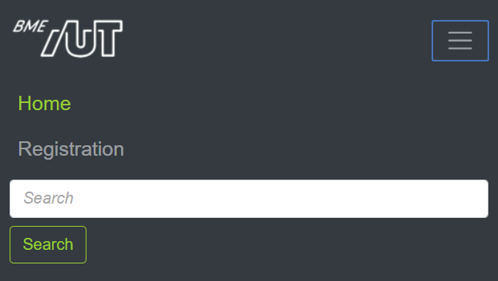
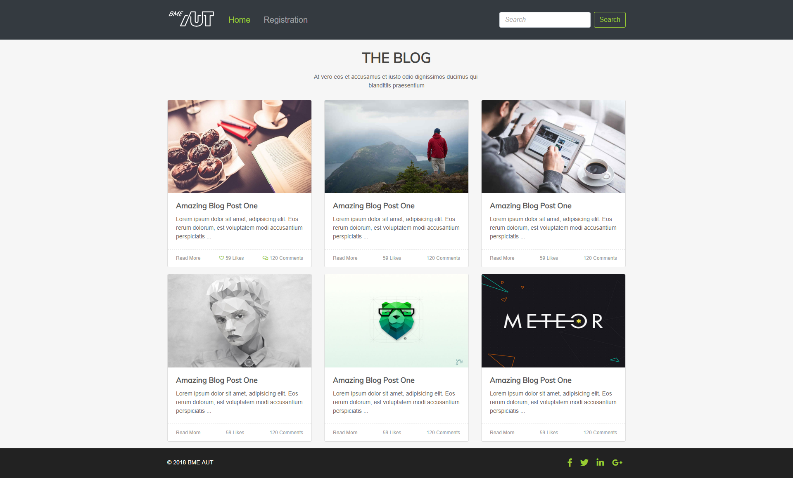
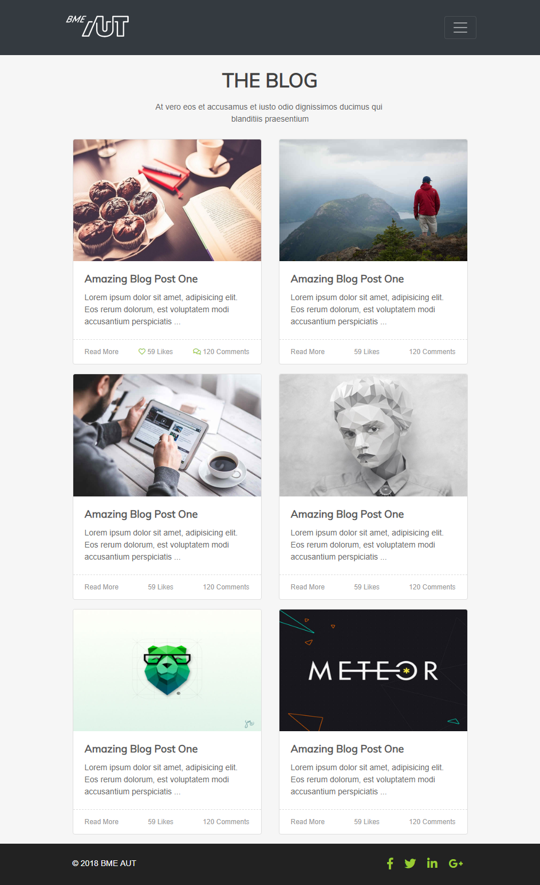
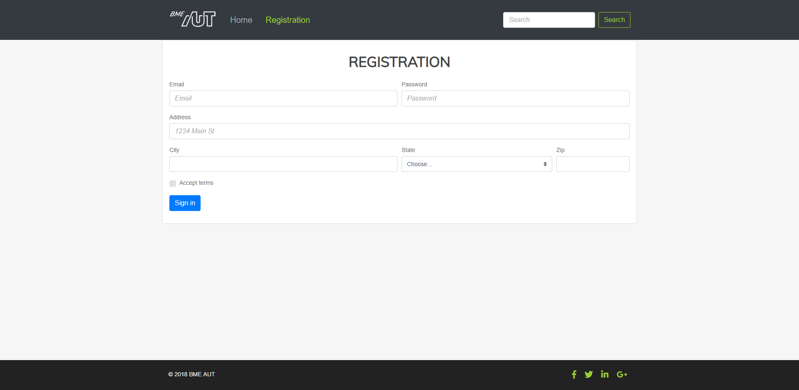
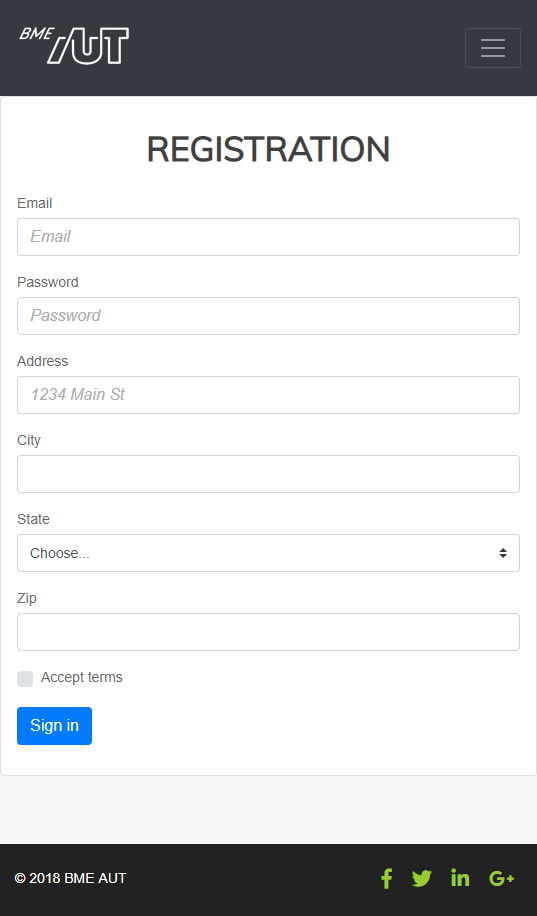

# Labor 10 - Bootstrap

## Bevezetés

A laborok során a hallgatók laborvezetői segítséggel, majd önállóan végeznek feladatokat a webes technológiák gyakorlati megismerése érdekében.

A feladatok megoldása során ne felejtsd el követni a feladat beadás folyamatát TODO LINK.

### Git repository létrehozása és projekt indítása

1. Moodle-ben keresd meg a laborhoz tartozó meghívó URL-jét és annak segítségével hozd létre a saját repository-dat.
2. Várd meg, míg elkészül a repository, majd checkout-old ki.
    * Egyetemi laborokban, ha a checkout során nem kér a rendszer felhasználónevet és jelszót, és nem sikerül a checkout, akkor valószínűleg a gépen korábban megjegyzett felhasználónévvel próbálkozott a rendszer. Először töröld ki a mentett belépési adatokat (lásd itt), és próbáld újra.
3. Hozz létre egy új ágat `megoldas` néven, és ezen az ágon dolgozz.
4. A neptun.txt fájlba írd bele a Neptun kódodat. A fájlban semmi más ne szerepeljen, csak egyetlen sorban a Neptun kód 6 karaktere.
5. Nyissuk meg a Visual Studio Code-dal a létrehozott könyvtárat (File -> Open Folder)!
6. Indítsuk el a Terminal (**Ctrl+ö** vagy **View > Integrated Terminal**) ablakból a http-server-t: `http-server`
7. Ellenőrizzük, hogy a megfelelő könyvtárban indítottuk-e el a szervert!

## Feladat 0. - Ismerkedés a kiinduló projekttel

A webfejlesztésben általános jelenség, hogy a dizájnerek csak egy képet készítenek el, hogy a felületnek hogyan kell kinéznie, ami alapján el kell készíteni a megfelelő HTML és CSS kódot a fejlesztőnek.

A mai labor alkalmával egy ilyen képből (és egy kicsi HTML váz segítségével) kell az oldalt elkészíteni.

A dizájnolás folyamán általában valamilyen keretrendszerből indulunk ki, mely kész megoldásokat ad a leggyakoribb feladatokra, így csökkentve az egyedi CSS mennyiségét. A [Bootstrap](http://getbootstrap.com) két alapvető funkciót nyújt:

* egységes formázás (gombok, színek) és grid alapú elrendezés kizárólag CSS-sel,
* gyakori komponensek (felugró ablakok, kártyák, nyitható-zárható blokkok, kiemelések, panelek) CSS-sel és/vagy JavaScriptből.

A laboron ezekből a kész komponensekből fogunk megismerni egy párat közelebbről is.

### Bootstrap hozzáadása egy HTML oldalhoz

Nyissuk meg az `index.html` fájlt, amit a labor során meg fogunk formázni.

Nézzük meg, hogy az oldal `head`-jében milyen állományokat és honnan töltünk be.

```html
<head>
    <meta charset="utf-8">
    <meta name="viewport" content="width=device-width, initial-scale=1">
    <title>MyBlog</title>

    <!-- Bootstrap linkelése CDN-ről -->
    <link rel="stylesheet" href="https://cdn.jsdelivr.net/npm/bootstrap@4.5.3/dist/css/bootstrap.min.css" integrity="sha384-TX8t27EcRE3e/ihU7zmQxVncDAy5uIKz4rEkgIXeMed4M0jlfIDPvg6uqKI2xXr2" crossorigin="anonymous">
    <!-- Font awesome 5 CDN-ről (solid, regular és brand is) -->
    <link rel="stylesheet" href="https://use.fontawesome.com/releases/v5.15.1/css/all.css" crossorigin="anonymous">
    <!-- Google font (Muli) letöltése -->
    <link href="https://fonts.googleapis.com/css?family=Muli" rel="stylesheet">
    <!-- Saját CSS -->
    <link rel="stylesheet" href="assets/css/site.css">
</head>
```

Figyeljük meg, hogy négy különböző CSS állományt töltünk be, egy kivételével CDN-ről:

1. Az első magát a Bootstrap-et tölti be.
2. Ezt követően egy gyakran használt ikongyűjteményt, a Font Awesome-ot töltjük le.
3. Ezen felül, mivel egyedi betűtípust használunk, azt a Google fonts oldaláról töltjük le.
4. A legutolsó hivatkozás pedig az általunk készített CSS fájlt hivatkozza be.

!!! note "Betöltési lehetőségek"
    A CSS és JS könyvtárakat többféleképpen is be tudjuk tölteni:

    * CDN-ről, publikus webről tölti le a CSS fájlt, amit most is használunk,
    * van lehetőségünk csomagkezelőt (npm, bower) használni letöltésre és magunk kiszolgálni a fájlt,
    * akár saját magunk kézzel is letölthetjük a megfelelő fájlokat, ebben az esetben is a saját webszerverünk szolgálja ki ezeket a fájlokat.

Ha az alkalmazás elrendezését szeretnénk megadni, elég sok boilerplate-jellegű CSS kódot kellene írnunk. A Bootstrap megközelítése, hogy a gyakori elrendezési lehetőségeket és stílusozási lehetőségeket készen és konfigurálhatóan adja nekünk.

A megvalósítandó oldal az alábbi főbb részekből áll:

* navigációs sáv,
* oldal központi eleme, ami blogbejegyzések listáját tartalmazza,
* lábléc.

## Feladat 1 - Navigációs sáv

A navigációs sáv felépítése legyen a következő (a HTML váz szerepel a kiinduló `index.html`-ben):

* bal szélen szerepeljen egy a BME AUT logo, ami az `assets/img/logo-bme-aut.png` útvonalon érhető el,
* ezt követően a két navigációs link: Home és Registration,
* a sáv jobb szélén pedig egy keresés szövegdoboz és egy Search feliratú gomb legyen.

A navigációs sáv az alábbiak szerint nézzen ki magas felbontáson


Mivel a navigáció is egy gyakori probléma, a Bootstrap ad rá kész komponenst, a **navbar**t.
A megvalósítás előtt nézzük meg, hogyan épül fel a [Bootstrap navbar](http://getbootstrap.com/docs/5.0/components/navbar/) komponense. Az oldalon találunk kész HTML vázakat is, amiből ha a megfelelőt kiválasztva bemásoljuk a saját kódunkba, apró módosításokkal el tudjuk érni a megfelelő kinézetet.

A legfontosabb osztályok, amire a navbar épít:

* `.navbar-brand` brand logo megjelenítésére.
* `.navbar-nav` teljes magasságú egyszerű navigációs elemek megadásához (a legördülő lista is támogatott).
* `.navbar-toggler` mobil nézeten el lehessen rejteni a linkeket egy hamburger menü alá.
* `.form-inline` ha valamilyen form controlt szeretnénk a navigációs sávba tenni.
* `.navbar-text` ha függőlegesen középre igazított szöveget szeretnénk használni.
* `.collapse.navbar-collapse` elemek csoportos elrejtésére használható.

!!! tip Dokumentáció
    Érdemes keresni a dokumentációban egy ahhoz hasonló megjelenést amire nekünk is szükségünk van és az ott található HTML kódot átalakítani a saját igényeinknek megfelelően.
    A sötét hátterű navbarhoz használjuk `navbar-dark` és `bg-dark` osztályokat.

!!! example "BEADANDÓ (0.5 pont)
    Készítse el a fent ismertetett navigációs sávot Bootstrap 4 segítségével.
    Az elkészült navigációs sávról illesszen be egy képernyőképet! (`f1.png`)

## Feladat 2 - Reszponzív megjelenés

A navigációt is reszponzívan kell megvalósítani, tehát ha átméretezzük az oldalt, akkor a navigációs menüpontokat el kell rejteni és egy úgynevezett hamburger menüt kell megjeleníteni helyette, amire kattintva megjelennek a menüpontok.

Még mielőtt nekiesnénk az egyedi megoldás kitalálására érdemes megnézni, hogy a Bootstrap támogatja ezt a funkcionalitást is, tehát csak a megfelelő HTML vázat kell kikeresni a [Bootstrap navbar](http://getbootstrap.com/docs/5.0/components/navbar/)  dokumentációjából és az alapján kiegészíteni a kódunkat. Tipp: `navbar-toggler`

A kész oldalnak így kell kinéznie.

Mobil eszközön zárva.
  


Mobil eszközön lenyitva



!!! example "BEADANDÓ (0.5 pont)"
    * Tegye reszponzívvá a navigációs menüt a fenti képeknek megfelelően.
    * Az elkészült teljes oldalról (ne csak a navigációs sávról) illesszen be egy-egy képernyőképet:
        * mobil nézeten, ahol nincs lenyitva a hamburger menü, (`f2.1.png`)
        * mobil nézeten, ahol le van nyitva a hamburger menü, (`f2.2.png`)
        * nem mobil nézeten. (`f2.3.png`)

### Feladat 2 iMSc - Navigációs sávban szabályok felüldefiniálása

A navigációs menüben a linkek fehér színűek, hiszen a Bootstrap erre állítja be.

Definiálja felül a Bootstrapben megadott menüpont színeket a site.css-ben úgy, hogy azok zöldek legyenek és ha egy menüpont fölé visszük az egeret, akkor váltson sötétzöldre. Az `!important` kulcsszót nem használhatja!

!!! example "iMSc BEADANDÓ (1 iMSc pont)"
    * Illesszen be egy képernyőképet a böngésző devTool (F12) ablakáról, amin látható, hogy milyen CSS osztály határozza meg most az egyes menüpontok (pl.: Home) betűszínét. Tipp: használja a `Computed` tabfület. (`f2.imsc1.png`)
    * A kész megoldásról csatoljon egy képernyőképet. (`f2.imsc2.png`)

## Feladat 3 - Egy kártya (blog bejegyzés) formázása

A navigáció után térjünk át a fő tartalmi elemre, a blog bejegyzésre. Először csak egy bejegyzést formázzunk meg. A blog post HTML váza már szerepel az index oldalon, ezt kell kiegészíteni a megfelelő Bootstrap osztályokkal és helyenként készíteni egy-egy CSS szabályt, amivel kiegészítjük a Bootstrap-es osztályokat.

A megoldáshoz használjuk a [Bootstrap card](http://getbootstrap.com/docs/5.0/components/card/)-ját.

* Mivel majd több kártya kerül egymás mellé a szélességet a grid oszlopaihoz használt `col-x` segítségével adjuk meg.
* A kép igazításához használjuk a `card-img-top` osztályt
* A szöveges rész legyen a kártya törzse `card-body`
* A címhez a `card-title` osztályt használjuk
* Az egyéb adatok pedig a kártya láblécében `card-footer` jelenjenek meg
    * a lábléc fölötti vonal legyen szaggatott,
    * a betűméret 12px,
    * a háttérszín átlátszó,
    * a láblécben szereplő linkek legyenek szürkék és ha fölé visszük az egeret akkor zöldek, de ne legyen aláhúzva. Az ikonok mindig legyenek zöldek.
    * Tipp: A lábléchez érdemes egyedi CSS osztály(oka)t is definiálni.
* Ügyeljen arra, hogy a margók és paddingok hasonlóak legyenek. Tipp: használja a `m-0`, `py-2`.... osztályokat. Részletesen a [Bootstrap spacing](http://getbootstrap.com/docs/5.0/utilities/spacing/) szekcióban lehet róla olvasni.

Az egyes blog bejegyzéseknek, az alábbi képen látható módon kell megjelennie:


!!! example "BEADANDÓ (1 pont)"
    Illesszen be egy képernyőképet a teljes oldalról, amin látható az elkészített blogpost megformázva. (`f3.png`)

## Feladat 4 - Reszponzív blog bejegyzés lista

Egészítse ki a HTML kódot úgy, hogy az oldalon összesen 6 blogbejegyzés jelenjen meg. Az egyes bejegyzések minden adata lehet azonos, csak a képeket cserélje le. A képeket az `assets/img` könyvtárban találja. Használja a Bootstrap által definiált [alapértelmezetten 12 hasábos grid rendszert](https://getbootstrap.com/docs/5.0/layout/grid/).

Az oldalt úgy valósítsa meg, hogy magas felbontáson 3 hasábos legyen, közepesen 2, kicsin pedig 1 hasábos.

Magas felbontáson
  


Közepes felbontáson



Kicsi felbontáson


!!! example "BEADANDÓ (1 pont)"
    Illesszen be egy-egy képernyőképet mindhárom felbontáson, a teljes oldalról. (`f4.png`)

## Feladat 5 - Oldal lábléc elkészítése

* A lábléc elkészítésekor a footerben egyedi CSS osztályban adja meg, hogy fekete legyen a háttér és fehér a betűszín.
* Ezen felül adjon meg megfelelő méretű paddingot, amihez használhatja a `p-4` CSS osztályt illetve annak egyéb változatait. Részletes leírás a [Bootstrap spacing](https://getbootstrap.com/docs/5.0/utilities/spacing/) fejezetben található.
* A copyright szöveg kerüljön balra, az ikonok pedig jobbra. Ehhez a flexboxot használja.
* Ügyeljen arra, hogy az egyes ikonok mérete és távolsága is megfelelő legyen.


!!! example "BEADANDÓ (0.5 pont)"
    Illesszen be egy képernyőképet az elkészített láblécről. (`f5.png`)

### Feladat 5 iMSc - Lábléc igazítása az oldal aljára

Dolgozzon ki megoldást arra, hogy az oldal lábléce mindig a látható képernyő alján legyen.

* Akkor is ha az oldalon kevés a tartalom és akkor is ha scrollozni kell az oldalon
* Soha ne takarjon ki tartalmi részt.
* Tipp: a megoldáshoz használhatja a `calc` függvényt a magasság számításához, vagy akár a flexboxot is.

!!! example "iMSc BEADANDÓ (0.5 iMSc pont)"
    Illesszen be egy-egy képernyőképet a teljes oldalról amikor azon kell scrollozni (`f5.imsc1.png`), illetve akkor is, amikor csak kevés tartalom van rajta (`f5.imsc2.png`). (A kevés tartalomhoz kommentezze ki a kártyák egy részét.)

## Feladat 6 - Regisztrációs űrlap létrehozása

Az elkészített oldal tetején található egy Register feliratú link, ami a register.html oldalra irányít. A feladat ennek az oldalnak az elkészítése.
Az oldal fejléc és lábléc része változatlan, tehát azt másolja át a meglévő index.html oldalról. Csak a navigáció utáni rész fog változni.

Az oldalon egy űrlapot kell készíteni, ahol a felhasználótó bekérjük a következő alábbi adatokat: **Email cím**, **Password**, **Address**, **City**, **State** (Tipp: `select`), **ZIP**.
Az űrlap végén legyen egy checkbox, hogy elfogadja a feltételeket illetve egy Sign in feliratú gomb, ami elküldi az űrlapot.

* Az inputok létrehozásánál ügyeljen mindig a megfelelő típus használatára.
* A szövegdobozokba tegyen placeholder szöveget is.
* Az alábbi képen látható elrendezést valósítja meg.



* Ellenőrizze, hogy az oldal kis képernyő méreten az alábbi elrendezésben jelenik-e meg. Ha nem, akkor javítsa a kódot, hogy az alábbi kinézetet kapja.



!!! example "BEADANDÓ (1.5 pont)"
    Illesszen be egy-egy képernyőképet az elkészített oldalról kicsi (`f6.1.png`) és magas (`f6.2.png`) felbontáson is.

### Feladat 6 iMSc - Regisztráció űrlap középre igazítása és placeholder design

* Flexbox segítségével igazítsa a regisztrációs űrlapot függőlegesen középre.
* Definiálja felül a placeholder szövegek megjelenítését is. Legyen piros dőlt betű a placeholder mindenhol. Tipp: `::placeholder`

!!! example "iMSc BEADANDÓ (0.5 iMSc pont)"
    Illesszen be az elkészített teljes oldalról egy képernyőképet, ahol a placeholderek is láthatóak. (`f6.imsc.png`)
